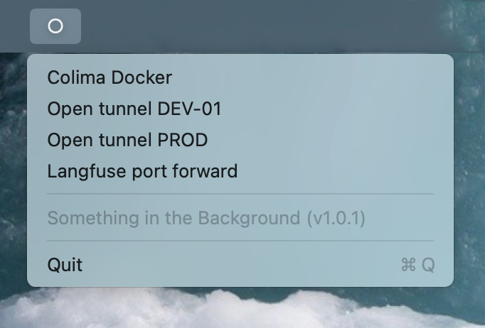

# Something in the Background



Something in the Background is a macOS menu bar application that helps manage SSH tunnels and background processes. It provides an easy way to start and stop various services through a simple menu interface.

## Features

- Simple menu bar interface
- Easy tunnel management
- Automatic cleanup on app termination
- Native macOS integration

## Installation

### Prerequisites

- Rust and Cargo (install via [rustup](https://rustup.rs/))
- Xcode Command Line Tools
- cargo-bundle (install with `cargo install cargo-bundle`)

### Building from Source

1. Clone the repository:
```bash
git clone https://github.com/vim-zz/something_bg.git
cd something_bg
```

2. Build and bundle the application:
```bash
cargo bundle --release
```

This will create a macOS application bundle in `target/release/bundle/osx/Something in the Background.app`

3. Move the app to your Applications folder:
```bash
cp -r "target/release/bundle/osx/Something in the Background.app" /Applications/
```

### Running

Simply double-click the "Something in the Background.app" in your Applications folder or launch it from Spotlight.

The app will appear as a menu bar item. The available options are configured via `~/.config/something_bg/config.toml`.

## Configuration

The app uses a TOML configuration file located at `~/.config/something_bg/config.toml`. On first run, the app will create this file with default settings.

### Configuration Format

```toml
# PATH environment variable for command execution
path = "/bin:/usr/bin:/usr/local/bin:/sbin:/usr/sbin:/opt/homebrew/bin"

[tunnels]

# Example: Docker environment management
[tunnels.colima]
name = "Colima Docker"
command = "colima"
args = ["start"]
kill_command = "colima"
kill_args = ["stop"]

# Example: Generic service management
[tunnels.my-service]
name = "My Background Service"
command = "my-service"
args = ["--daemon", "--config", "/path/to/config"]
kill_command = "pkill"
kill_args = ["-f", "my-service"]

# Example: Development server
[tunnels.dev-server]
name = "Development Server"
command = "npm"
args = ["run", "dev"]
kill_command = "pkill"
kill_args = ["-f", "npm.*dev"]
```

### Configuration Fields

Each tunnel configuration includes:
- `name`: Display name shown in the menu
- `command`: Command to execute
- `args`: Array of command arguments
- `kill_command`: Command used to stop the process
- `kill_args`: Array of arguments for the kill command

The global `path` setting defines the PATH environment variable used when executing commands.

### Customization

You can add, remove, or modify tunnel configurations by editing the TOML file. **Note: You need to restart the app to pick up configuration changes.**

## License

MIT
