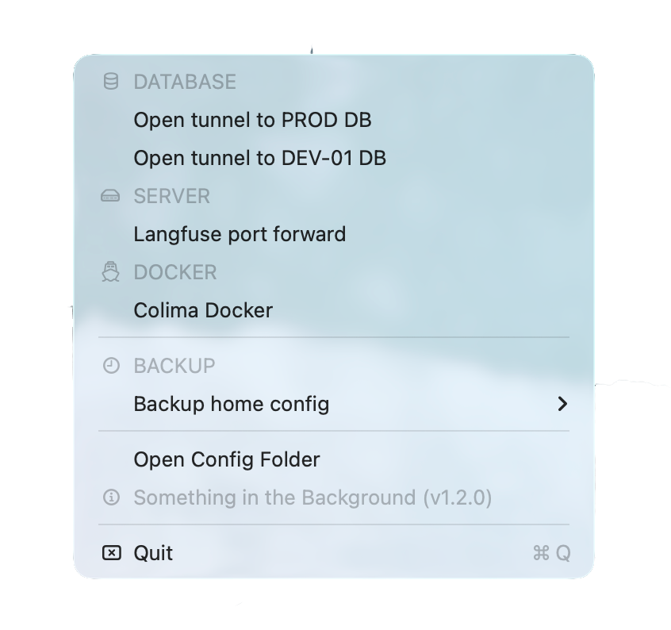

# Something in the Background



A macOS menu bar application for managing background processes like SSH tunnels, port forwarding, and development services. Everything is configured via a simple TOML file.

## Features

- Toggle any CLI tool on/off from the menu bar
- **Scheduled tasks with cron syntax** - run commands periodically in the background
- TOML based configuration
- Automatic process cleanup on app termination
- Custom PATH environment support
- Native macOS integration
- Group headers with SF Symbol icons for organizing menu items
- Visual separators between menu sections
- Real-time task status with last run timestamps

## Installation

### Prerequisites

- Rust and Cargo (install via [rustup](https://rustup.rs/))
- Xcode Command Line Tools
- cargo-bundle (install with `cargo install cargo-bundle`)

### Building from Source

1. Clone the repository:
```bash
git clone https://github.com/vim-zz/something_bg.git
cd something_bg
```

2. Build and bundle the application:
```bash
cargo bundle --release
```

3. Move the app to your Applications folder:
```bash
cp -r "target/release/bundle/osx/Something in the Background.app" /Applications/
```

Launch the app from your Applications folder. It will appear as a menu bar item.

## Configuration

The app loads all menu items from `~/.config/something_bg/config.toml`. On first run, it creates this file with example configurations.

### Example Configuration

```toml
# Custom PATH for command execution
path = "/bin:/usr/bin:/usr/local/bin:/opt/homebrew/bin"

[tunnels]

# SSH tunnel with port forwarding
[tunnels.database-prod]
name = "PROD"
command = "ssh"
args = ["-N", "-L", "5432:localhost:5432", "user@server.com"]
kill_command = "pkill"
kill_args = ["-f", "user@server.com"]
group_header = "DATABASE"           # Optional: Section header
group_icon = "sf:cylinder.fill"     # Optional: SF Symbol icon

[tunnels.database-dev]
name = "DEV"
command = "ssh"
args = ["-N", "-L", "5432:localhost:5432", "dev@server.com"]
kill_command = "pkill"
kill_args = ["-f", "dev@server.com"]
separator_after = true              # Optional: Add separator after this item

# Kubernetes port forwarding
[tunnels.k8s-service]
name = "Service"
command = "kubectl"
args = ["port-forward", "svc/my-service", "8080:8080"]
kill_command = "pkill"
kill_args = ["-f", "svc/my-service"]
group_header = "KUBERNETES"
group_icon = "sf:cloud.fill"

# Development server
[tunnels.dev-server]
name = "Dev Server"
command = "npm"
args = ["run", "dev"]
kill_command = "pkill"
kill_args = ["-f", "npm.*dev"]
group_header = "DEVELOPMENT"
group_icon = "sf:hammer.fill"
separator_after = true

[schedules.daily-backup]
name = "Daily Backup"
command = "/usr/local/bin/backup.sh"
args = []
cron_schedule = "0 6 * * *"          # Every day at 6:00 AM
group_header = "SCHEDULED TASKS"
group_icon = "sf:clock.fill"
```

### Configuration Fields

**For Tunnels:**
- `name`: Display name in the menu
- `command` + `args`: Command to start the service
- `kill_command` + `kill_args`: Command to stop the service

**For Scheduled Tasks:**
- `name`: Display name in the menu
- `command` + `args`: Command to execute
- `cron_schedule`: Cron expression for scheduling (e.g., "0 6 * * *")

**Optional fields (both types):**
- `group_header`: Section title (e.g., "DATABASE", "SCHEDULED TASKS")
- `group_icon`: SF Symbol name for the header (e.g., "sf:cylinder.fill", "sf:clock.fill")
- `separator_after`: Add a visual separator line after this item

### Scheduled Tasks

Schedule commands to run automatically using cron syntax. Perfect for backups, health checks, or recurring maintenance tasks.

```toml
[schedules.daily-backup]
name = "Daily Backup"
command = "/usr/local/bin/backup.sh"
args = []
cron_schedule = "0 6 * * *"          # Every day at 6:00 AM
group_header = "SCHEDULED TASKS"
group_icon = "sf:clock.fill"

[schedules.hourly-health-check]
name = "API Health Check"
command = "curl"
args = ["-f", "https://api.example.com/health"]
cron_schedule = "0 * * * *"          # Every hour

[schedules.weekly-cleanup]
name = "Weekly Cleanup"
command = "/usr/local/bin/cleanup.sh"
args = ["--deep"]
cron_schedule = "0 3 * * 0"          # Every Sunday at 3:00 AM
separator_after = true
```

**Cron Schedule Format:** `minute hour day_of_month month day_of_week`

Common examples:
- `0 * * * *` - Every hour
- `*/15 * * * *` - Every 15 minutes
- `0 6 * * *` - Every day at 6:00 AM
- `0 9 * * 1` - Every Monday at 9:00 AM
- `0 0 1 * *` - First day of every month at midnight

### SF Symbols

Group icons use SF Symbols (built-in macOS icons). Common symbols:
- `sf:cylinder.fill` - Database
- `sf:shippingbox.fill` - Cache/Redis
- `sf:chart.bar.fill` - Analytics
- `sf:cloud.fill` - Cloud/Kubernetes
- `sf:server.rack` - Server
- `sf:network` - Network
- `sf:clock.fill` - Scheduled tasks
- `sf:calendar` - Time-based operations

Browse all symbols at [developer.apple.com/sf-symbols](https://developer.apple.com/sf-symbols/) or use the SF Symbols app.

Restart the app to pick up configuration changes.

## License

MIT
