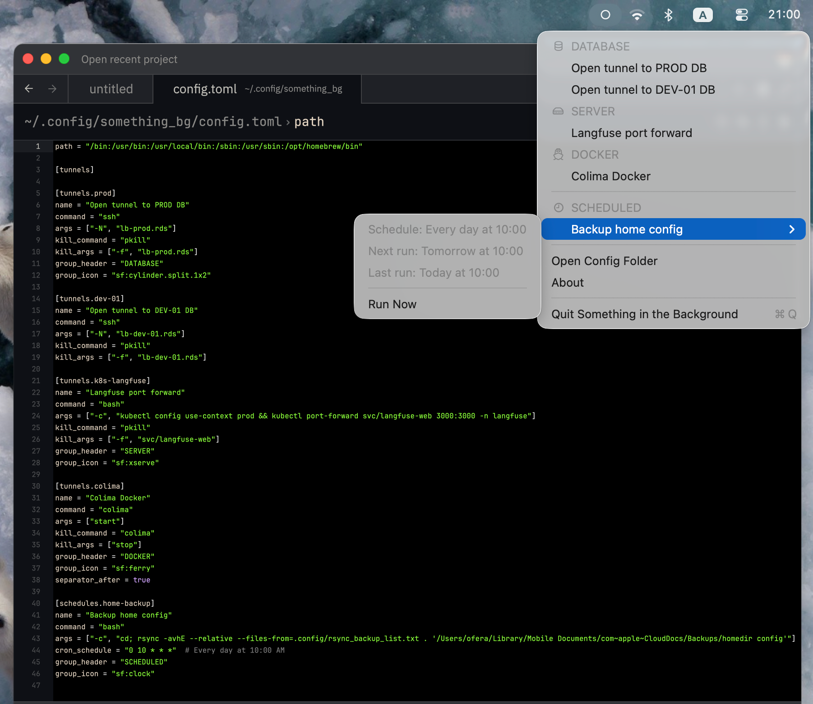

# Something In The Background

A native menu bar utility for managing background processes, SSH tunnels, and scheduled tasks.



## Features

- Run SSH tunnels, port forwards, and development servers without keeping terminals open
- Schedule tasks using cron syntax
- Toggle services on/off from the menu bar
- Cross-platform support (macOS, Linux, Windows)
- Lightweight (<1MB) with simple configuration

## Installation

### macOS

**Step 1: Install Rust** (skip if already installed)
```bash
curl --proto '=https' --tlsv1.2 -sSf https://sh.rustup.rs | sh
source $HOME/.cargo/env
```

**Step 2: Install build tools**
```bash
xcode-select --install
cargo install cargo-bundle
```

**Step 3: Build and install**
```bash
git clone https://github.com/vim-zz/something_bg.git
cd something_bg
./scripts/bundle-macos.sh
cp -r "target/release/bundle/osx/Something in the Background.app" /Applications/
```

Launch from Applications or run: `open "/Applications/Something in the Background.app"`

### Linux

**Prerequisites** (Ubuntu/Debian):
```bash
curl --proto '=https' --tlsv1.2 -sSf https://sh.rustup.rs | sh
source $HOME/.cargo/env
sudo apt install libayatana-appindicator3-dev libgtk-3-dev
```

**Build and run**:
```bash
git clone https://github.com/vim-zz/something_bg.git
cd something_bg
cargo run -p something_bg_linux --release
```

### Windows

**Build on Windows**:
```powershell
# Install Rust from https://rustup.rs/
git clone https://github.com/vim-zz/something_bg.git
cd something_bg
cargo build -p something_bg_windows --release
.\target\release\something_bg_windows.exe
```

## Configuration

Configuration is stored in `~/.config/something_bg/config.toml` (created on first run).

### Example

```toml
path = "/bin:/usr/bin:/usr/local/bin:/opt/homebrew/bin"

# SSH tunnel
[tunnels.database]
name = "Database (PROD)"
command = "ssh"
args = ["-N", "-L", "5432:localhost:5432", "user@server.com"]
kill_command = "pkill"
kill_args = ["-f", "user@server.com"]
group_header = "DATABASE"
group_icon = "sf:cylinder.fill"

# Port forwarding
[tunnels.k8s-service]
name = "API Service"
command = "kubectl"
args = ["port-forward", "svc/api", "8080:8080"]
kill_command = "pkill"
kill_args = ["-f", "svc/api"]
group_header = "KUBERNETES"
separator_after = true

# Scheduled task
[schedules.backup]
name = "Daily Backup"
command = "/usr/local/bin/backup.sh"
args = []
cron_schedule = "0 6 * * *"
group_header = "SCHEDULED"
group_icon = "sf:clock.fill"
```

### Fields

**Tunnels** (toggleable services):
- `name` — Display name
- `command`, `args` — Start command
- `kill_command`, `kill_args` — Stop command
- `group_header` _(optional)_ — Section title
- `group_icon` _(optional)_ — SF Symbol (e.g., `sf:cylinder.fill`)
- `separator_after` _(optional)_ — Add separator

**Schedules** (cron jobs):
- `name` — Display name
- `command`, `args` — Command to run
- `cron_schedule` — Cron expression (`minute hour day month weekday`)

**Common cron patterns**:
- `0 * * * *` — Every hour
- `*/15 * * * *` — Every 15 minutes
- `0 6 * * *` — Daily at 6am
- `0 9 * * 1` — Mondays at 9am

### SF Symbols (macOS icons)

Common symbols for `group_icon`:
- `sf:cylinder.fill` — Database
- `sf:shippingbox.fill` — Cache/Redis
- `sf:cloud.fill` — Cloud/Kubernetes
- `sf:server.rack` — Server
- `sf:network` — Network
- `sf:clock.fill` — Scheduled tasks
- `sf:hammer.fill` — Development

Browse all symbols at [developer.apple.com/sf-symbols](https://developer.apple.com/sf-symbols/) or use the SF Symbols app.

Restart the app after editing the config.

## License

MIT
