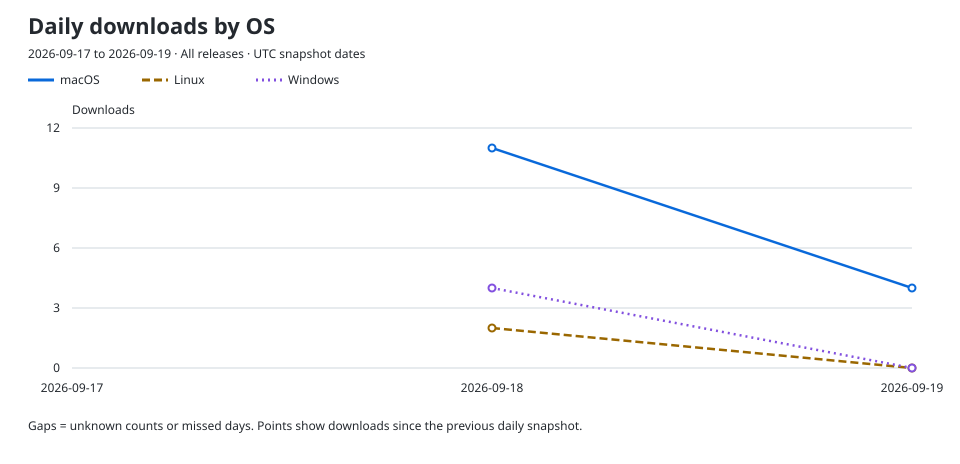
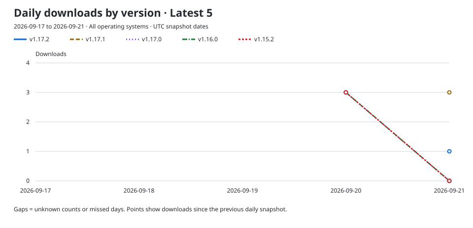

# Download statistics

The chart sums all releases per OS over the latest 60 calendar days. Unknown counts and multi-day intervals appear as gaps, not zeros.

The version chart sums all operating systems for the five highest semantic versions in the latest snapshot, including minor, patch, and prerelease tags. Days before a version was observed and unknown intervals appear as gaps.

Latest snapshot: 2026-09-26T04:58:27Z (UTC).

Counts cover downloads between snapshots, not unique users or exact calendar days. The first snapshot is a baseline; no earlier download history is available.

In the CSV, blank downloads mean an unknown interval (baseline, missing/replaced asset, or counter reset). A multi_day row covers a gap; its downloads cannot be assigned to individual days. Totals are current counters for assets still available, including downloads before tracking began.

All observations and exact UTC interval boundaries are in [daily.csv](daily.csv); raw asset counters are in [snapshots/](snapshots/).

